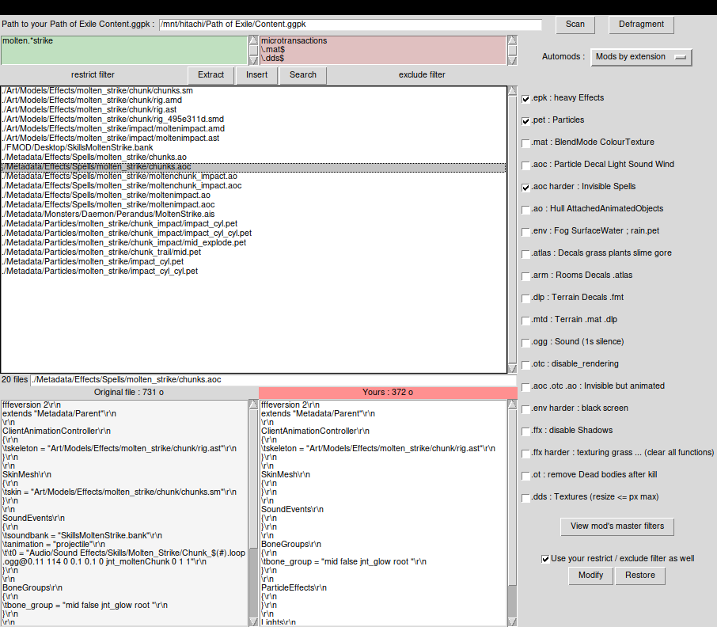
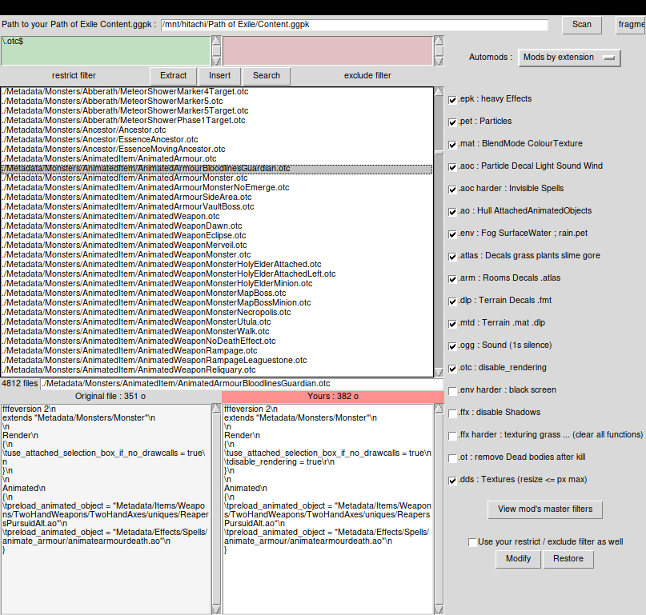

# Path of Exile modding tool and mods

- Search modify compare extract insert replace armour spells microtransactions in any way.
- Many known mods (.aoc .otc .epk .pet .atlas .env ...) or create yours.
- Batch process files. Create automods (.txt files with basic filters and commands) to apply all your mods in sequence (see two examples below).
- Restrict and exclude filters to modify only some files.
- Resize textures. Textures (.DDS) are decompressed when extracted, ready to feed a DDS optimizer (DDSOpt, ...) to improve both performance and quality.
- Automatic backup. Defragment. Works on all PoE versions, does not depend on Grinding Gear Games updates : file search and file mods rely on Python.re regular expressions
- Any OS. Install [Python 3](https://www.python.org/). Open the command line and run `pip3 install brotli`. Click `__init__.py` to launch app.

### Example : TabulaRasa model change for MTX


*Automod example : Templar Tabula Rasa one-click model change for a microtransaction.*

Create a .txt file with the following commands, put it in the automods folder and it will show up in the program.
```
name "Change TabulaRasa model"
restriction "BodyArmours.*TabulaRasa/BodyTabulaRasaStrInt.sm$"
replacewith "BodyArmours/Microtransactions/DeicideArmour/DeicideArmourStrInt.sm$"
```

### Example : Advanced PoeSmoother


*Another automod : improved Advanced PoeSmoother, does not depend on GGG updates.*

# Tutorials

### Make a spell invisible



1. Narrow down the search results to your spell thanks to the include/exclude filters.
2. Select the "Mods By Extension" automod.
3. Check the .aoc harder, .epk and .pet checkboxes
4. Check "Use your restrict/exclude filter as well"
5. Click Modify

### Config for bots



1. Select the "Mods by extension" automod
2. Check almost everything (See pic above)
3. Click Modify
4. Click "Defragment" and then "Defragment now"
6. Copy the defragmented Content.ggpk.defrag over your game Content.ggpk
7. Close the app or click the Scan button
8. In Path of Exile's production_Config.ini put texture_quality=10

### Create a new mod

1. Create a new file in the mods folder named trl_0.py
```
def execute(filename, backupfiledata, modifyggpk):
  filedata, encoding, bom = modifyggpk.stringcleanup(backupfiledata, "UTF-16-LE")
  filedatamod="0"
  return filedatamod, encoding, bom
```
`filedata` is the content of one matching file as a string.
`filedatamod` is the content of the file written back to the Content.ggpk.
This mod is replacing the content of the whole file with a 0.

2. Create a new file in the automods folder named trails.txt
```
name ".trl modification test"
restriction "\.trl$"
execute "trl_0"
```

### Create a mod using Python.re

1. Create a new file in the mods folder named aoc_nosound.py
```
import re
def execute(filename, backupfiledata, modifyggpk):
  filedata, encoding, bom = modifyggpk.stringcleanup(backupfiledata, "UTF-16-LE")
  # -- modify filedata string here --
  filedatamod=re.sub(r'SoundEvents.*?\{.*?\}', r'SoundEvents\r\n{\r\n}', filedata, flags=re.DOTALL)
  # ...
  # -- give back filedatamod string --
  return filedatamod, encoding, bom
```
This mod clears everything between the SoundEvents brackets, if any. See [Python.re documentation](https://docs.python.org/3/library/re.html).

2. Create a new file in the automods folder named removesounds.txt
```
name "remove sounds from aoc"
restriction "\.aoc$"
execute "aoc_nosound"
```

### Autmods available commands

Each .txt file put in the automods folder will be shown in the application. All commands are executed in sequence.

1. __name "*xyz*"__
*will show the xyz automod in the app*
2. __title "*first checkbox*"__
*will create a checkbox to apply (or not) everything following, up to the next title (0 or more)*
3. *one or more of these filters :*
   - __restriction "*Python.re regular expression*"__
	 *files matching these filters will be modified*
   - __exclude "*Python.re regexp*"__
	 *files matching these filters will not be modified*
4. *one of these commands :*
   - __execute "*mod_filename_noext*"__
     *executes mod_filename_noext.py that should exist in the mods folder*
   - __replacewith "*Python.re regexp*"__
	 *replaces the file with another one from the game, there should be only one match to this replacewith regexp.*
   - __restore "*Python.re regexp*"__
     *restores the original files matching Python.re regexp*
   - __extract "*Python.re regexp*"__
     *extracts original matching files to the extracted folder*
   - __insert "*Python.re regexp*"__
     *inserts matching files of the extracted folder in the game*

Repeat (3. 4.) if needed. Checkboxes (2.) are optional.

You can check your regular expressions in the app's restrict/exclude filter fields, thanks to the Search button. All of these regexp ignore case : Python.re's `flags=re.IGNORECASE` is set. Folder separator has to be `/`.
